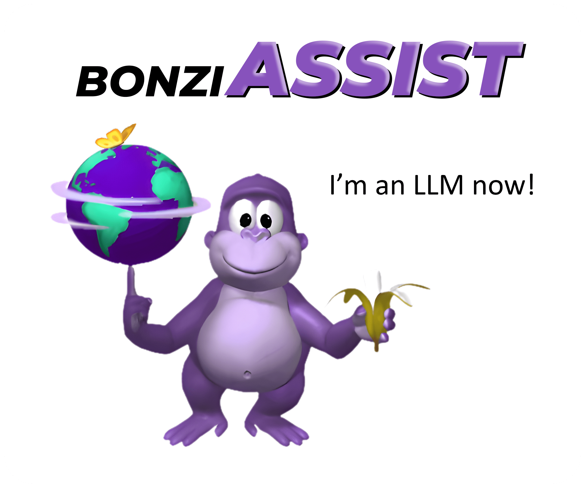

<div style="text-align: center;">
    
</div>

## BonziAssist: Your New (Old) Assistant!
This project uses the [TETYYS generator](https://www.tetyys.com/SAPI4/). Also see: [BonziBuddy-TTS](https://github.com/dot-Justin/BonziBuddy-TTS).
### ⚠️ Do Not Abuse the API ⚠️
BonziAssist revives the classic BonziBuddy assistant in a modern, voice-activated form, allowing you to interact with an AI through spoken commands. Here’s a bit more about what makes BonziAssist special and how to use it.

### Features
- **Voice Activation**: Simply say "`Bonzi`" and once you hear Bonzi confirm he's listening, you're ready to go!
- **Text-to-Speech**: Utilizes the nostalgic BonziBuddy voice for responses, thanks to the [TETYYS SAPI4 API](https://www.tetyys.com/SAPI4/).
- **Real-Time Interaction**: Communicate in real-time, with responses generated through a lightweight LLM.

### Installation
1. Clone this repository.
2. Ensure you have [Python](https://www.python.org/downloads/) and [Visual CPP Build Tools](https://visualstudio.microsoft.com/visual-cpp-build-tools/). installed, and then run `pip install -r requirements.txt` to install the necessary packages.
4. Set up your environment variables. Edit the `.env.example` file in `helpers\` and follow the instructions there. `[INSTRUCTIONS='Remove this line of instructions. Fill out the info below. Rename this file, and remove the .example. It should just be ".env" now.']`

### Usage
To start BonziAssist:
```bash
python main.py
```

You will be prompted to configure your microphone settings upon the first run or if you choose to be prompted every time by the configuration settings.

## TODO

- [x] **Add LiteLLM**: Enable Bonzi to talk back to you
- [ ] **HIGH PRIO: Improve STT Accuracy**: Potentially use a bigger VOSK model
- [ ] **Improve STT Speed**: Potentially use a different package
- [ ] **Improve TTS Speed**: Find a way to run locally for quicker responses
- [ ] **Offline Functionality**: Use fully offline APIs such as Ollama for those with beefier computers
- [ ] **Add Voice Volume Control**
- [ ] **Add simple windows functions**: Such as Media control, opening apps, etc.
- [ ] **Add fancy splash screen**

#### Continuous goals

- When VOSK misunderstands, add to the list of phrases Bonzi will respond to
- Update system prompt to give more personality and functionality
- Optimize Performance

Contributors are welcome to help with these tasks. If you are interested, please fork the repository, make your changes, and submit a pull request. If you have any questions, feel free to open an issue and ask away!

## How it Works
1. Listening: The system starts by listening for the activation word "Bonzi". Once heard, it's ready to receive commands.
2. Processing: Speech is converted to text and processed by an LLM to understand the context and generate an appropriate response.
3. Responding: The response is then converted to speech using the SAPI4 API, maintaining the classic voice of BonziBuddy.
## Contributing
First of all, I appreciate anyone being excited about this project. That being said, contributions are welcome! For major changes, please open an issue first to discuss what you would like to change.

## Acknowledgments
- **SAPI4**: The Text-to-Speech engine that allows BonziAssist to speak with the classic BonziBuddy voice. [Visit TETYYS's online SAPI4](https://www.tetyys.com/SAPI4/).
- **BonziBuddy-TTS GitHub Project**: Inspired the integration of the BonziBuddy voice into this project. [View the repository](https://github.com/dot-Justin/BonziBuddy-TTS).
- **Vosk Speech Recognition**: Provides the voice recognition capabilities required to interpret user commands. [Learn more about Vosk](https://alphacephei.com/vosk/).
- **LitteLLM**: For processing natural language and generating responses. Their LLM services form the backbone of BonziAssist's AI capabilities.
- **SimpleAudio**: Used for playing back audio responses generated by the system.
- **PyAudio**: Handles microphone input and audio stream management.
- **Python-dotenv**: For managing environment variables in a .env file, which helps secure API keys and other sensitive settings.
- **GitHub Community**: For all the open-source contributors who have developed libraries and tools that made this project feasible.