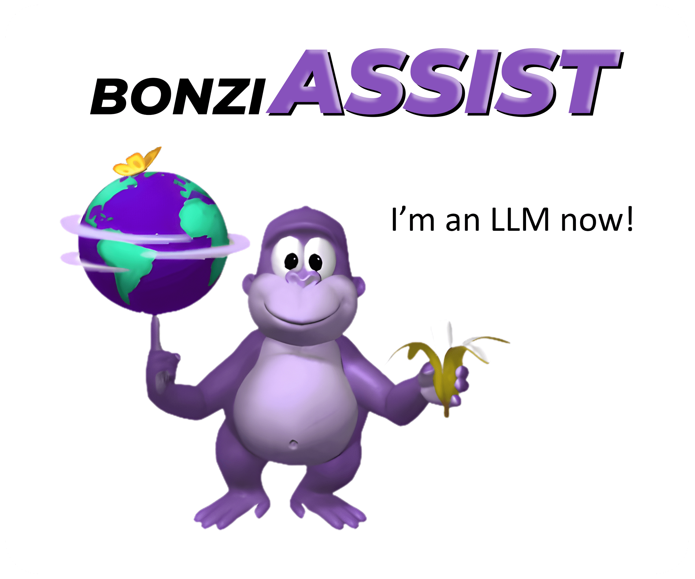

<div style="text-align: center;">
    
</div>

## BonziAssist: Your New (Old) Assistant!

BonziAssist is a voice-activated assistant using Vosk speech recognition, LiteLLM, and the TETYYS SAPI4 voice API.

### Prerequisites

- Python 3
- Visual C++ Build Tools on Windows, as required by PyAudio
- A microphone
- A LiteLLM-compatible API key configured in `helpers/.env`
- The Vosk model `vosk-model-small-en-us-0.15`

### Installation

1. Clone the repository and enter it:

   ```bash
   git clone https://github.com/dot-Justin/BonziAssist.git
   cd BonziAssist
   ```

2. Install dependencies:

   ```bash
   python -m pip install -r requirements.txt
   ```

3. Configure the environment file:

   - Copy `helpers/.env.example` to `helpers/.env`.
   - Remove the instruction line and provide the requested API configuration.

4. Download `vosk-model-small-en-us-0.15` from the [Vosk models page](https://alphacephei.com/vosk/models).

5. Extract it to:

   ```text
   BonziAssist/vosk/vosk-model-small-en-us-0.15/
   ```

   A different location can be used by setting `BONZI_VOSK_MODEL` to the extracted model directory.

### Usage

Start BonziAssist from the repository root:

```bash
python main.py
```

On the first run, select a microphone. The selection is stored in the repository-root `mic_config.json`. Set `BONZI_MIC_CONFIG` to use a custom configuration path.

Startup now reports an actionable error when the Vosk model is missing instead of failing inside the Vosk library.

### Troubleshooting

- **Vosk model not found:** verify the extracted folder name and location, or set `BONZI_VOSK_MODEL`.
- **Microphone selection is wrong:** delete `mic_config.json` and start again.
- **PyAudio installation fails:** install the platform audio development tools and Visual C++ Build Tools on Windows, then retry the dependency installation.
- **Environment values are missing:** verify that `helpers/.env` exists and contains the values described in `helpers/.env.example`.

### Features

- Voice activation using the word “Bonzi” and common recognition variants
- Speech recognition through Vosk
- Responses generated through LiteLLM
- BonziBuddy-style text-to-speech through TETYYS SAPI4

## Contributing

Contributions are welcome. For major changes, open an issue first to discuss the proposed scope.

## Acknowledgments

- [TETYYS SAPI4](https://www.tetyys.com/SAPI4/)
- [BonziBuddy-TTS](https://github.com/dot-Justin/BonziBuddy-TTS)
- [Vosk](https://alphacephei.com/vosk/)
- LiteLLM, SimpleAudio, PyAudio, and Python-dotenv
